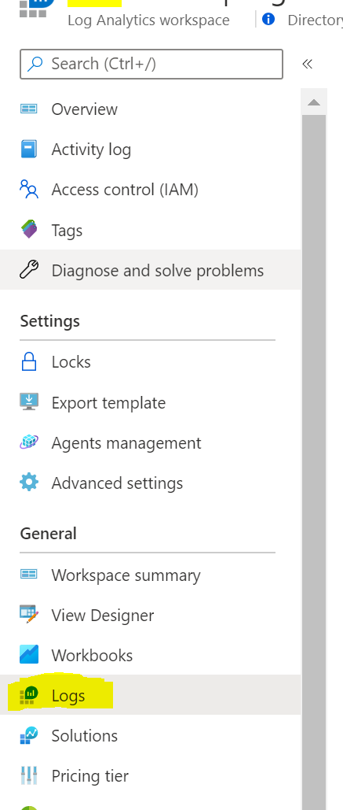
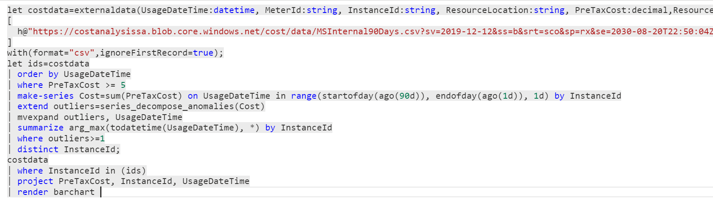

# Azure Cost Anomalies  

Below we will walk through a solution that calls the Azure Cost Management Export Rest API from Logic Apps. This rest API creates a CSV on blob storage which can then be queries by Log Analytics. We will then use the Kusto Query language to find anomalies in the data.  

## Required Resources  

-- Storage Account
-- Logic Apps  
-- Log Analytics Workspace  
-- Azure Monitor Workbook   

## Pre-Req  
Before starting you'll need to create a storage account with a blob container to place the exported cost data into. For the demo below I've created a storage account called costanalysissa that has a container called cost. We put all the exported data into a folder called data.

##  Creating the Logic Apps workflow  

1) Create a new Logic Apps and select "Blank Logic App" Template  

  

2) In the template designer select code view  

3) Remove the content in the Code View and replate it with the content of the "LogicApp.json" found in this repository  

  

4) Click on "Save" and then back on the "Designer" view  

##  Creating the Logic App Managed Identity and Grant RBAC Role  

1) In the newly created Logic App go to the "Identity" tab

  

2) Enable the "System Assigned" Identity and then click on the option for **Azure Role Assignment**  

3) Grant the Identity the **Cost Management Contributor** role at the scope that you need to query at.

  

##  Modifying the Logic App

1) Modify the "Days to Look Back" step. This determines how much data you want to pull so by default it's set to -30 which will pull 30 days.

  

2) Modify the "Export Name" step. This determines the name given to your export in Cost Management.

  

3) Modify the "Query Scope" step. This determines the scope used during the API call in the export. Ex: subscription\/\<subscriptionid\> or managementgroup\/\<managementGroupID/>

##  Add Management of Blob Output  
By default the export creates a csv file with a random guid in the name. We will move that content to a blob with a static name so our Log Analytics Query will work. The below steps add three actions that do the following:  
-- Get the content of the new export data  
-- Copy that content into a root folder using a static name. This will overright the file if it already exists  
-- Delete the blob created during the export  

1) Below the "Wait for execution to complete" step click on the **Add new step** option

  

2) Search for **Storage Account** and click on **Azure Blob Storage**  

  

3) Search for **Blob Content** and click on **Get blob content**  

 

4) Being this is your first time connecting to a storage account you'll need to select the SA. Below I've named my connection CostStorage and then seleted the account I want to place the cost data into. Once selected you need to select **Create** at the bottom.

 

5) In the **Get Blob Content** step you need to fill in the **Blob** field. Type in /cost/ and then from the dynamic content select **FilePath**

 

6) Below the **Get Blob Content** step add another step and again search for **Storage Account** and click on **Azure Blob Storage**  

7) Choose the **Create Blob** action

  

8) Fill in the following:  
    -- Folder Path: **/cost/data/**
    -- Blob Name: **Name for static File** ex: MSInternal90Days.csv
    -- File Content: Choose **File Content** from the dynamic content section

   

9) Below the **Create Blob** step add another step and again search for **Storage Account** and click on **Azure Blob Storage**  

10) Choose the **Delete Blob** action  

  

12) In the **Delete Blob** step you need to fill in the **Blob** field. Type in /cost/ and then from the dynamic content select **FilePath**

 

13) Save your Logic App and then run it
  
## Creating the SAS Token for the Blob  
Log Analytics can query into a storage but we need to create a SAS token for it to utilize.   
1) Open your storage account where the data is exported to.  

2) Click on the **Shared Access Signiture** tab

  

2) Below is a screenshot of the setting for the SAS token. Make sure you extend the expiration data into the future:  

3) Click on the **Generate SAS and connection string**. Make sure you copy and store the SAS token. This is the only time this will be visible.  

  

## Test the Log Analytics Query  
We can now test the query to the storage account in log analytics.  

1) Open your Log Analytics Workspace and go to the **Log** tab  

 

2) In the main pain we want to try the following query:  

    let costdata=externaldata(UsageDateTime:datetime, MeterId:string, InstanceId:string, ResourceLocation:string, PreTaxCost:decimal,ResourceGroup:string, ResourceType:string, Tags:string )  
    [  
    h@"**\<URI to Blob\>\<SAS Token\>**"  
    ]  
    with(format="csv",ignoreFirstRecord=true);  
    let ids=costdata  
    | order by UsageDateTime  
    | where PreTaxCost >= 5  
    | make-series Cost=sum(PreTaxCost) on UsageDateTime in range(startofday(ago(90d)), endofday(ago(1d)), 1d) by InstanceId  
    | extend outliers=series_decompose_anomalies(Cost)  
    | mvexpand outliers, UsageDateTime  
    | summarize arg_max(todatetime(UsageDateTime), *) by InstanceId  
    | where outliers>=1  
    | distinct InstanceId;  
    costdata  
    | where InstanceId in (ids)  
    | project PreTaxCost, InstanceId, UsageDateTime  
    | render barchart   

 