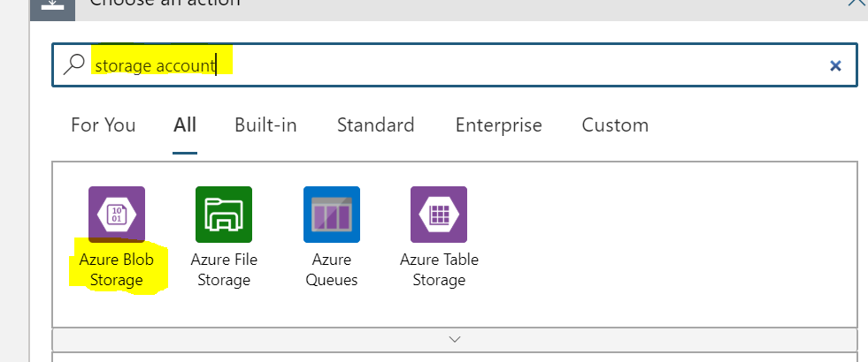
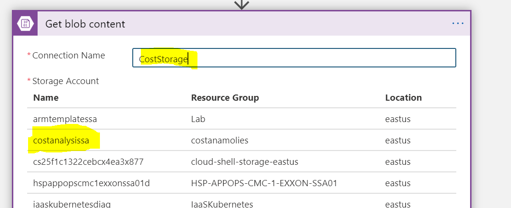

# Azure Cost Anomalies  

Below we will walk through a solution that calls the Azure Cost Management Export Rest API from Logic Apps. This rest API creates a CSV on blob storage which can then be queries by Log Analytics. We will then use the Kusto Query language to find anomalies in the data.  

## Required Resources  

-- Storage Account  
-- Logic Apps  
-- Log Analytics Workspace  
-- Azure Monitor Workbook   

## Pre-Req  
Before starting you'll need to create a storage account with a blob container to place the exported cost data into. For the demo below I've created a storage account called costanalysissa that has a container called cost. We put all the exported data into a folder called data.

##  Creating the Logic Apps workflow  

1) Create a new Logic Apps and select "Blank Logic App" Template  

  

2) In the template designer select code view  

3) Remove the content in the Code View and replate it with the content of the "LogicApp.json" found in this repository  

  

4) Click on "Save" and then back on the "Designer" view  

##  Creating the Logic App Managed Identity and Grant RBAC Role  

1) In the newly created Logic App go to the "Identity" tab

  

2) Enable the "System Assigned" Identity and then click on the option for **Azure Role Assignment**  

3) Grant the Identity the **Cost Management Contributor** role at the scope that you need to query at.

  

##  Modifying the Logic App

1) Modify the "Days to Look Back" step. This determines how much data you want to pull so by default it's set to -30 which will pull 30 days.

  

2) Modify the "Export Name" step. This determines the name given to your export in Cost Management.

  

3) Modify the "Query Scope" step. This determines the scope used during the API call in the export. Ex: subscription\/\<subscriptionid\> or managementgroup\/\<managementGroupID/>

##  Add Management of Blob Output  
By default the export creates a csv file with a random guid in the name. We will move that content to a blob with a static name so our Log Analytics Query will work. The below steps add three actions that do the following:  
-- Get the content of the new export data  
-- Copy that content into a root folder using a static name. This will overright the file if it already exists  
-- Delete the blob created during the export  

1) Below the "Wait for execution to complete" step click on the **Add new step** option

  

2) Search for **Storage Account** and click on **Azure Blob Storage**  

  

3) Search for **Blob Content** and click on **Get blob content**  

 

4) Being this is your first time connecting to a storage account you'll need to select the SA. Below I've named my connection CostStorage and then seleted the account I want to place the cost data into. Once selected you need to select **Create** at the bottom.

 

5) In the **Get Blob Content** step you need to fill in the **Blob** field. Type in /cost/ and then from the dynamic content select **FilePath**

 

6) Below the **Get Blob Content** step add another step and again search for **Storage Account** and click on **Azure Blob Storage**  

7) Choose the **Create Blob** action

  

8) Fill in the following:  
    -- Folder Path: **/cost/data/**
    -- Blob Name: **Name for static File** ex: MSInternal90Days.csv
    -- File Content: Choose **File Content** from the dynamic content section

   

9) Below the **Create Blob** step add another step and again search for **Storage Account** and click on **Azure Blob Storage**  

10) Choose the **Delete Blob** action  

  

12) In the **Delete Blob** step you need to fill in the **Blob** field. Type in /cost/ and then from the dynamic content select **FilePath**

 

13) Save your Logic App and then run it
  
## Creating the SAS Token for the Blob  
Log Analytics can query into a storage but we need to create a SAS token for it to utilize.   
1) Open your storage account where the data is exported to.  

2) Click on the **Shared Access Signiture** tab

  

2) Below is a screenshot of the setting for the SAS token. Make sure you extend the expiration data into the future:  

3) Click on the **Generate SAS and connection string**. Make sure you copy and store the SAS token. This is the only time this will be visible.  

  

## Import Azure Monitor Workbook    
Azure Workbooks are a great option to get insights from the data in the csv file. We'll generate a Workbook that looks for anamalies in the cost per ResourceGroup.

1) Open Azure Monitor and open the Workbooks tab    

 

2) In the main pain click on "New" at the top:  

 

3) On the top toolbar click on **Advanced Editor**

  

4) In the editor past the content of **CostWorkbook.json** in this repo

  

5) Click on **Apply** to enter the editing Windows.  

6) In the editor you need to change the value of the **CSVURL** parameter to be the URL to the csv file. This should look like \<bloburl\>\<sastoken\>  

  

7) Go ahead and select a Log Analytics Workspace from the drop also. Being we are querying data in a blob storage account I'd suggest picking a workspace that is in the same location as the storage account. 

**Note: The blob url will only be visible while editing the workook and not visible when viewing it

8) Click on the **Save** button. Give your workook a name and place it in a resource group. If you want others to be able to see it save it as a **Shared** workbook.  

  

9) You can now click on **Done Editing** and start to utilize the workbook.  

## Alerting  
We can now work on setting up alerting on anamalies. In the below example we'll utilize Logic App to execute whenever the csv file is updated and look for any **Resource Group** that had an anomalie.  

1) Create a new Logic Apps and select "Blank Logic App" Template  

 

2) The Logic App Designer will open with the trigger selection available. Look for **Storage Account** and select the **Azure Blob Storage**  

  

3) Choose the **When a blob is added or midified** trigger  

  

4) Being this is your first time connecting to a storage account you'll need to select the SA. Below I've named my connection CostStorage and then seleted the account I want to place the cost data into. Once selected you need to select **Create** at the bottom.

 

5) In the **Container** property you need to put the folder where you placed the csv file. This was done in the **Add Management of Blob Output** step 8  

  

6) Below your trigger click on **Add New Step** and look for **Azure Monitor**. You'll select the **Azure Monitor Logs**  

  

7) Select the **Run Query and Visualize Results** action

  

8) Fill in the Properties:  

- Subscription: Suscription where the Log Analytics Workspace is located  
- Resource Group: Resource Group where the Log Analytics Workspace is located  
- Resource Type: Log Analytics Workspace  
- Resource Name: Name of Log Analytics Workspace  
- Query: Enter the below **Change the URI connection to the Blob csv file**  

    let costdata=externaldata(UsageDateTime:datetime, MeterId:string, InstanceId:string, ResourceLocation:string,   PreTaxCost:decimal,ResourceGroup:string, ResourceType:string, Tags:string )  
    [  
    h@"**\<BlobURI\>\<SASToken\>**"  
    ]  
    with(format="csv",ignoreFirstRecord=true);  
    let ids=costdata  
    | order by UsageDateTime  
    | where PreTaxCost >= 5  
    | make-series Cost=sum(PreTaxCost) on UsageDateTime in range(startofday(ago(90d)), endofday(ago(1d)), 1d) by ResourceGroup  
    | extend outliers=series_decompose_anomalies(Cost)  
    | mvexpand outliers, UsageDateTime  
    | summarize arg_max(todatetime(UsageDateTime), *) by ResourceGroup  
    | where outliers>=1   
    | distinct ResourceGroup;  
    costdata  
    | where ResourceGroup in (ids)  
    | where UsageDateTime >= ago(7d)  
    | summarize PreTaxCost=sum(PreTaxCost) by ResourceGroup, UsageDateTime  
    | order by ResourceGroup, UsageDateTime desc  

    - Time Range: 90d  
    - Chart Type: HTML Table  

  

9) Click on **New Action** below the **Run Query and Visualize Results**. Search for **Condition** and select **Control**.  

  

10) In the **Control** actions choose **Condition**  

  

11) In the **Condition** use the following properties:  
- **Dynamic Fied**: Attachment Content  
- **Not Equal to**
- PGJvZHk+VGhlIHF1ZXJ5IHlpZWxkZWQgbm8gZGF0YVRhYmxlLjwvYm9keT4=  

  

12) In the **If true** section click on **Add an Action**  

13) Repeate steps 6-8 but ths time use the below query  

    let costdata=externaldata(UsageDateTime:datetime, MeterId:string, InstanceId:string, ResourceLocation:string,   PreTaxCost:decimal,ResourceGroup:string, ResourceType:string, Tags:string )  
    [  
    h@"**\<BlobURI\>\<SASToken\>**"    
    ]  
    with(format="csv",ignoreFirstRecord=true);  
    let ids=costdata  
    | order by UsageDateTime  
    | where PreTaxCost >= 5  
    | make-series Cost=sum(PreTaxCost) on UsageDateTime in range(startofday(ago(90d)), endofday(ago(1d)), 1d) by ResourceGroup  
    | extend outliers=series_decompose_anomalies(Cost)  
    | mvexpand outliers, UsageDateTime  
    | summarize arg_max(todatetime(UsageDateTime), *) by ResourceGroup  
    | where outliers>=1  
    | distinct ResourceGroup;  
    costdata  
    | where ResourceGroup in (ids)  
    | where UsageDateTime >= ago(7d)  
    | summarize PreTaxCost=sum(PreTaxCost) by InstanceId, UsageDateTime  
    | order by InstanceId, UsageDateTime desc  

14) Add a new action after the last step (but still in the **if true** section) and search for **Outlook**. Choose the **Office 365 Outllok** actions  

  

15) In the actions windows search for **Send email** and choose **Send an email (v2)**. Note: This action will send an email from your email account. For production you would want to setup a **shared mailbox** and choose the action **Send an email from a shared mailbox (v2)**  

  

16) The first time using this connector it ask you to login to Office 365 to make the connection. Once you've done this fill in the following properties:  

- Body: You can fill in whatever you want for the body. Below is an example of what I entered:  
    Cost Anamolies were deteted for Resource Groups in your environment. Attached are the details on the Resource Groups causing the anamolies and the Resources in those Resource Groups.  
- Subject: You can fill in whatever you want for the subject. Below is an example of what I entered:  
    RG Cost Anamolies  
- To: Whoever you want to recieve the emails. This can be a ; deliminated list  
- Click on **Add new Parameter** and click the check box next to **Attachments**. Click back in on of the other fields like **To:** to make the attachment parameters available.  
- Click on **Add new Item** so that you have two atachments available. Fill in the following for the Attachement Parameters:  
    - **Attachments Content - 1**: From the Dynamic Content select the **Attchment Content** from **Run Query and Visualize Results**. It should be the second one in the list.

 

    - **Attachments Content - 1**: From the Dynamic Content select the **Attchment Content** from **Run Query and Visualize Results**. It should be the second one in the list. 
    - **Attachments Name - 1**: RGCost7Days.html
    - **Attachments Content - 2**: From the Dynamic Content select the **Attchment Content** from **Run Query and Visualize Results 2**. It should be the first one in the list. 
    - **Attachements Name - 2**: ResourceIdCost7Days.html  

17) **Save** the Logic App and click on **Run**. The next time the csv file is updated on the blob this logic app should run and alert if there is any anamolies.  

 